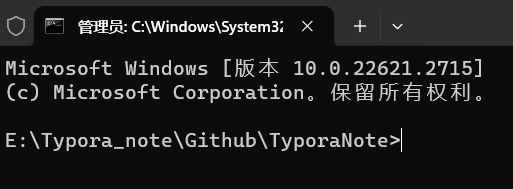
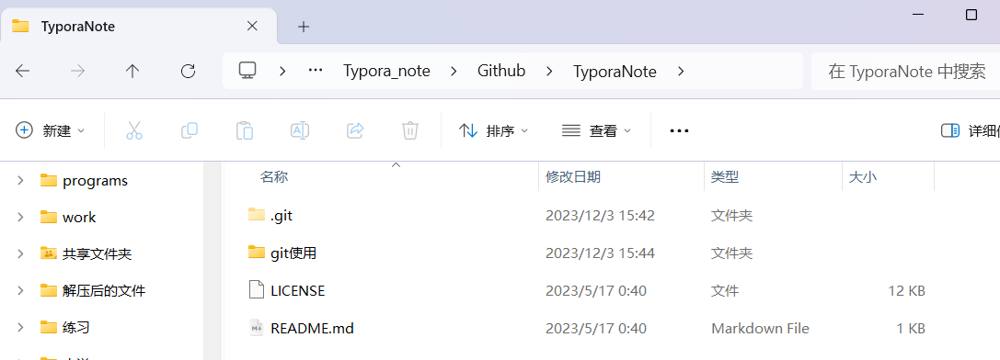
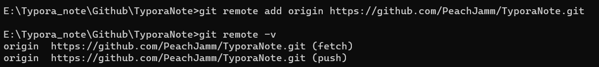

查看是否安装git以及安装版本：git version

安装位置：where git

git --help


【git管本地仓库】

进入想用git管的文件夹内，在文件夹内按Ctrl + L(选中路径),在路径上输入cmd ,立刻出现命令窗口且为当前路径输入：git init





【本地文件夹推到github】

初始化用户信息：

 git  config --global user.email "<your email>"
 git config --global user.name "<your name>"

关联远程仓库：

git remote add origin https://github.com/<your name>/learngit.git



删除远程仓库： git remote rm origin


【使用】

查看当前仓库信息——git status

查看版本信息——git log

**推上去：**

到暂存区——git add 文件名/.

到仓库——git commit -m "版本名"

到远程仓库——git push -u origin master

（-u 将本地master分支和远程master分支关联起来，第一次使用过，后面就不用了）

**拉下来：**

git clone https://github.com/<your name>/learngit.git


【分支】

```bash
# 查看分支
git branch

# 新建名为tt分支
git branch tt

# 切换至tt分支
git checkout tt

# 上述新建和切换可以一步到位
git checkout -b tt

# 将tt分支合并到master分支
git checkout master # 记得切换回master分支
git merge tt # 如果master和tt分支有冲突则会失败
 
# 删除tt分支
git branch -d tt
```


【版本回退】

```bash
# 回退至上一版本^、上上版本^2、上上上版本^3、以此类推
git reset --hard HEAD^1

# 通过查看日志里的版本号，回退至某个版本
git reset --hard d99eba2b6aae274196ec4a93ea3e7e2ef8467553
```